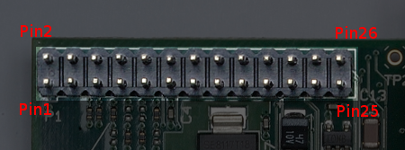
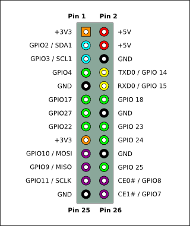
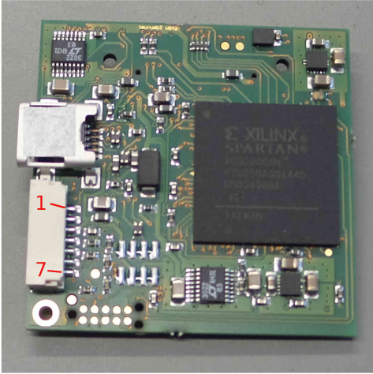
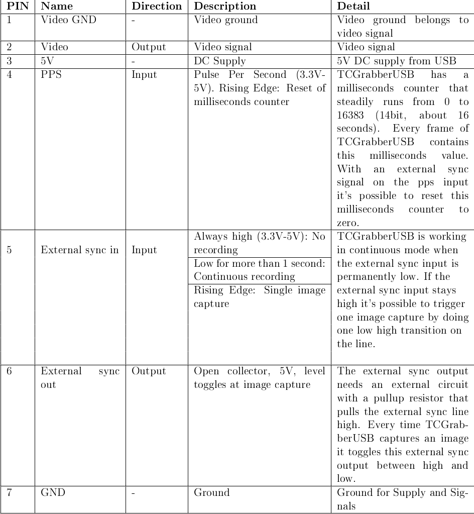

# Ariel Dataset Collector

## Installation

1. Setup the RPi4 with the latest Raspbian OS (tested using Raspbian 11 bullseye, with python 3.9)
   - Enable SSH by default in the installation process (in advanced settings in the RPi imager tool).
   - If the RPi should work with a known wifi network, it can also be set in the advanced settings.
   - Set the hostname for the RPi to `tauRpi`, and the username to `pi`.
2. Connect to the RPi using SSH (using the hostname or IP address):

```
ssh pi@tauRpi
```

3. Notice - the clock on the RPi does not update automatically, so it should be set manually before every `git pull` or `apt update`:

```
sudo date -s "JULY 19 2023 12:00:00"
```

4. Install dependencies:

```
sudo apt install git python3-pip python-tk python3-tk
```

4. Clone or Download the project `https://github.com/navotoz/DualTauUAV.git`
5. Set the cloned folder as the default path by adding to the very end of ~/.bashrc:
   `cd ~/DualTauUAV`
6. Add USB buffer to the system (See [link](https://www.flir.com/support-center/iis/machine-vision/application-note/understanding-usbfs-on-linux/))
   - `sudo touch /etc/rc.local`
   - `sudo chmod 744 /etc/rc.local`
   - Add:
   ```
   #!/bin/sh -e
   echo 1000 > /sys/module/usbcore/parameters/usbfs_memory_mb
   exit 0
   ```
   - If file already exists just add the echo 1000... line before the exit 0 line.
   - Restart the computer.
   - Run `cat /sys/module/usbcore/parameters/usbfs_memory_mb` to check if the buffer was added.

#### Privileges for cameras

7. Write `sudo su` and enter the computer's root password.
8. Write:

```
echo "SUBSYSTEM==\"usb\", ACTION==\"add\", ATTRS{idVendor}==\"0403\", ATTRS{idProduct}==\"6010\", MODE=\"0666\"">/etc/udev/rules.d/99-taucamera.rules
```

9. Write:
   `sudo usermod -a -G dialout $USER`
10. If 1-5 doesn't work, check which USB the device is connected to via `lsusb` and write in terminal:
    `sudo chmod 666 #` Where # is the correct device address.

#### WIFI hotspot

11. Setup the VNC connection (I prefer Remmina). Use:
    `https://raspberrypi.stackexchange.com/questions/142654/remmina-does-not-connect-to-raspberry-pi-bullseye-after-realvnc-server-update`
12. Create a wifi hotspot in the RPi by following the instructions in the link:
    `https://www.tomshardware.com/how-to/raspberry-pi-access-point`

#### Docker

13. Install docker `https://docs.docker.com/engine/install/raspbian/`
14. Ensure that the user is in the docker group by running:
    `sudo usermod -aG docker $USER`
15. Make docker run on startup:

```
sudo systemctl enable docker.service
sudo systemctl enable containerd.service
```

16. **Reboot**
17. Ensure the docker is correctly installed by running:
    `docker run hello-world`

18. To initiate the docker and make it run automatically at startup, run:
    `docker-compose up --build`
19. To stop the docker, run: `docker-compose down`

# Undervoltage in the RPi

- In terminal:
  `vcgencmd get_throttled`
  Bit Hex Value Meaning
  0 1 Under-voltage detected
  1 2 ARM frequency has been caped
  2 4 Currently throttled
  3 8 Soft temperature limit is active
  16 1000 Under-voltage has occurred
  17 2000 ARM frequency capping has occurred
  18 4000 Throttling has occurred
  19 8000 Soft temperature limit has occurred

https://pimylifeup.com/raspberry-pi-low-voltage-warning/

# Testing the Hardware trigger

### Noitce - use testing program (test_hardware_trigger.py)



Connection:

- Blue with orange strip (7 in the JST) -> GND, AKA Pin 9
- Yellow with orange strip (8 in the JST) -> GPIO 17, AKA Pin 11
- Blue (6 in the JST) -> GPIO 27, AKA Pin 13

### Pinout of cable Lavi made (see schematic of Teax grabber for Pinout of JST cable)

1. Red
2. Green with tape
3. Green
4. Yellow
5. Yellow with orange strip
6. Blue
7. Blue with orange strip

### ThermalCapture GrabberUSB




# Run tkinter in ssh

- In terminal:
  `export DISPLAY=:0.0`


# Enter Docker instead of running gunicron
Chnage the last line to ```CMD ["/bin/bash"]```

# Transform coordiantes from Israeli to WGS84
1. python utils/coordinates/csv2csv.py -i test.csv # test.csv --->test_out.csv , heights.csv
2. python utils/coordinates/csv2djipilot.py test_out.csv -o output.kml  # test_out.csv ---> output.kml